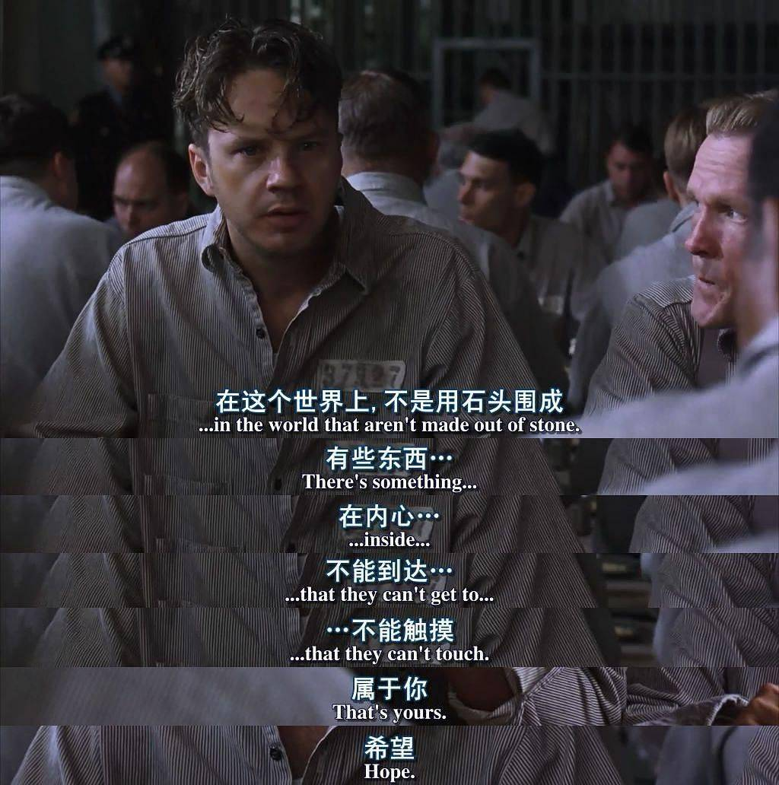

## 我喜欢的一个电影人物---安迪

###                          ---观看《肖申克的救赎》有感

### 1.故事概述：

##### 		20世纪40年代末，小有成就的青年银行家安迪（蒂姆·罗宾斯 饰）因涉嫌杀害妻子及她的情人而锒铛入狱。在这座名为肖申克的监狱内，希望似乎虚无缥缈，终身监禁的惩罚无疑注定了安迪接下来灰暗绝望的人生。未过多久，安迪尝试接近囚犯中颇有声望的瑞德（摩根·弗里曼 饰），请求对方帮自己搞来小锤子。以此为契机，二人逐渐熟稔，安迪也仿佛在鱼龙混杂、罪恶横生、黑白混淆的牢狱中找到属于自己的求生之道。他利用自身的专业知识，帮助监狱管理层逃税、洗黑钱，同时凭借与瑞德的交往在犯人中间也渐渐受到礼遇。表面看来，他已如瑞德那样对那堵高墙从憎恨转变为处之泰然，但是对自由的渴望仍促使他朝着心中的希望和目标前进，最终实现自由。

### 2.故事片段分析：

####       (1):安迪被诬陷入狱

#### 	   (2):安迪在狱中的经历：

##### 			    其中让我印象深刻的是:

##### 						(1):屋顶上的啤酒

安迪用他的理财能力帮助狱警逃税，实现了屋顶上的“自由”

用瑞德的来说，他们就像造物主一样自在

对于罪犯来说，这是奢侈的。

#####    		            (2)安迪提到希望

这属于点题了

生活中总有一些事情是我们难以预料的，不要忘了，这个世界穿透一切高墙的东西，他就在我们的内心深处，他们无法到达，也接触不到，那就是希望；希望是美好的食物，也许是世上最美好的事物。美好的事物从不消逝。

##### 						(3)有些鸟儿是关不住的
https://ts4.cn.mm.bing.net/th?id=OIP-C.nyEAMSRuF50wnvUrVS_bwwHaHa&w=250&h=250&c=8&rs=1&qlt=90&o=6&dpr=1.6&pid=3.1&rm=2

**<u>有的鸟毕竟是关不住的，他们的羽翼太光辉了</u>**

安迪坐了19年的监狱，实现了自由

##### 安迪身上的精神

##### 			(1):可怕的耐性

##### 			(2):对自由的渴望

##### 			(3):对希望的坚持
